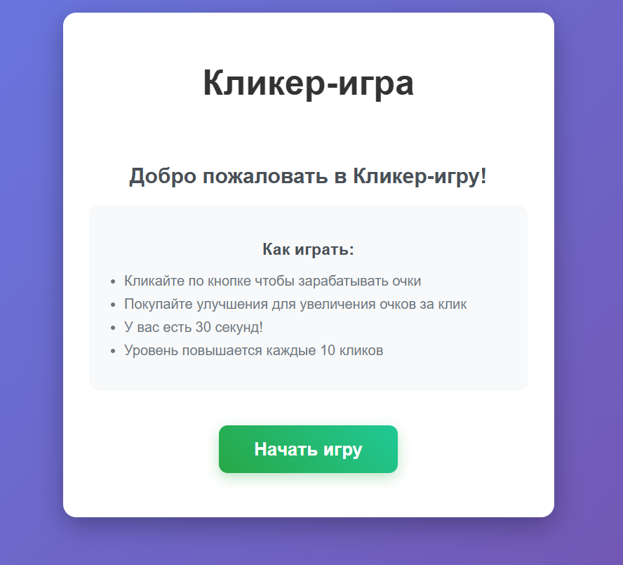
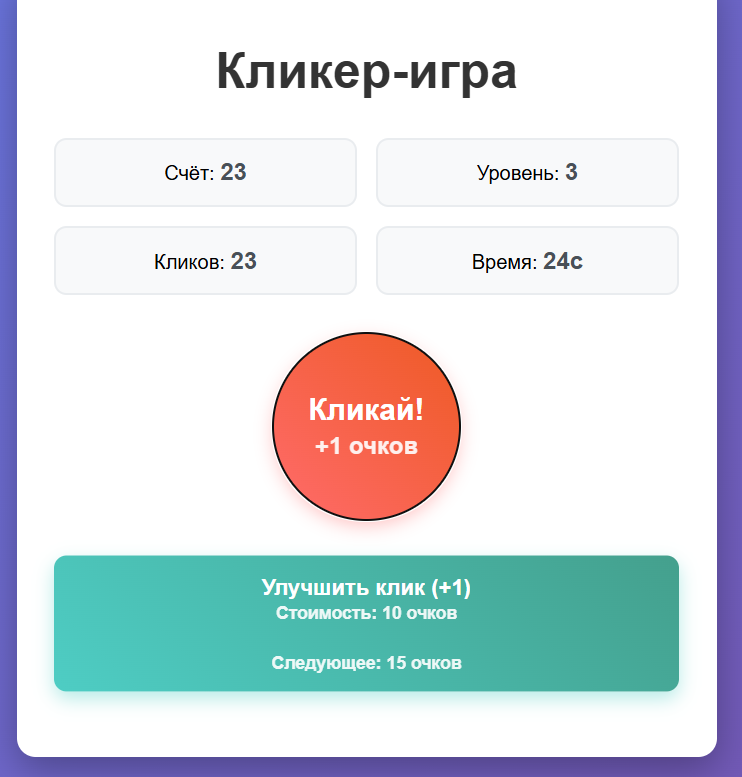
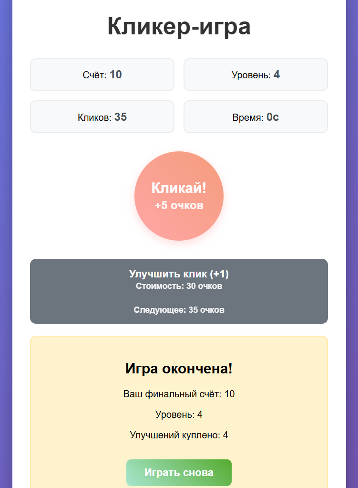

# Кликер игра на React 
Основной геймплей
Кликайте по центральной кнопке для заработка очков

Покупайте улучшения для увеличения очков за клик

Управляйте временем - игра длится 30 секунд

Повышайте уровень - каждые 10 кликов увеличивают уровень 

## Механики игры
Начальная стоимость улучшения: 10 очков

Фиксированное увеличение стоимости: +5 очков за каждое улучшение

Увеличение эффективности: +1 очко за клик за каждое улучшение

Повышение уровня: каждые 10 кликов

## Особенности приложения

Интуитивный дизайн с крупными кнопками и четкой статистикой

Адаптивная верстка - корректное отображение на разных устройствах

React Hooks - использование useState и useEffect 

Локальное состояние - все данные хранятся в состоянии React

## Скриншоты

Экран приветствия с правилами игры

  

Гемйплей

  

Экран завершения игры с итоговой статистикой

  

